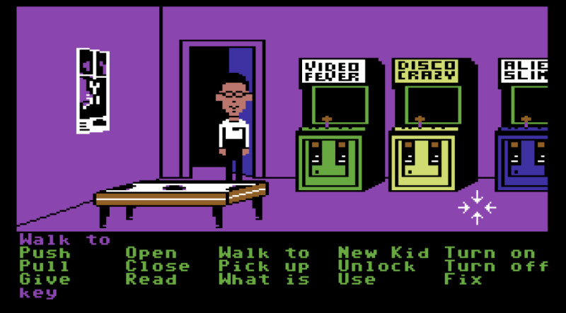
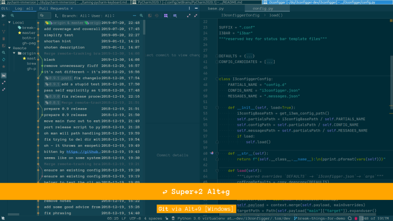

# An IDE is not a Point And Click Adventure 

Based on "Taming the Complexity of PyCharm from your Keyboard" first presented at the [Bangalore Python Developers Meetup](https://www.meetup.com/Bangalore-Python-Group/events/269907207)).

**Intended Audience:** I believe that these materials are useful for all experience levels to learn how to use PyCharm or any other Intellij based IDE in a more keyboard centric and therefore more effective way.

Using a tool mainly from the keyboard far exceeds knowing a few shortcuts to navigate somewhere quicker or manipulate code more effectively. It also means navigating and controlling the complete user interface. It also means changing the way about how think about using your tool and dropping some ingrained habits. This is mainly an exercise in how far you can take this keyboard centric approach in a vaguely systematic manner.

PyCharm (or any other Intellij IDEA based tool) is quite good at making a lot if its UI keyboard accessible. There are still quite a few corners where you simply can't get without pointing and clicking (yet), so I will also be pointing out a few things, where there is still room for improvement, when you try to use the IDE in that way. It's entirely possible that some of those shortcomings are not shortcomings of the tool, but shortcomings of my own understanding and then I will hope you will get in touch and teach me a few new tricks then.

**(overview pycharm default UI)**

*(overview pycharm customized with screenkey and presentation assistant)*

*(my german notebook keyboard (which I use most of the time))*

## What you see in the screencasts

* Linux with a [tiling window manager (i3wm)](https://github.com/obestwalter/i3config)
* PyCharm with my [customized settings](https://github.com/obestwalter/pycharm-settings)
* [screenkey](https://www.thregr.org/~wavexx/software/screenkey/) (fixed orange bar at bottom of the screen) to make (almost) all key presses visible
* [presentation assistant plugin](https://plugins.jetbrains.com/plugin/7345-presentation-assistant) to show the name of (most) actions I trigger via the keyboard, plus the default shortcut on Windows if they exist (orange popup)

### To make sure I don't cheat ...

I switch the touchpad off most of the time - you when toggling the state a popup like this appears:

 

# General shortcuts (not PyCharm specific)

Doing more things from the keyboard is in part independent from the concrete tool and often not even depending on the operating system you use. Many paradigms are shared between programs and making use of them can mean having to reach for the mouse less.

## Activate Context Menu with the Keyboard

Instead of **mouse right click**, you can use the `Menu` key on the keyboard (if it exists). In my case I have one on my keyboard, but I need to press **FN+RIGHT-CTRL**, which is very inconvenient for something I do often, so I assigned it to **SUPER+y**. How you can assign global shortcuts highly depends on the operating system or window manager you use, so you need to find that out for your particular environment, but in general you can do some nifty things with scriptable tools that specialize on that: you can use [xdotool (Linux)](https://github.com/jordansissel/xdotool), [autohotkey (Windows)](https://www.autohotkey.com/) or [(I have no idea) (macOs)](https://alternativeto.net/software/xdotool/?platform=mac) to assign a (more convenient) keyboard shortcut to activate the context menu for the active element (and many more things).

## Make use of Mnemonics

[Mnemonics](https://en.wikipedia.org/wiki/Mnemonics_(keyboard))
 are an idiom used by many graphical user interfaces. If a program uses mnemonics you will see certain characters in menus underlined to signal that you can choose that activity or component by pressing **ALT+[mnemonic]**.
 
PyCharm has two flavours of mnemonics: menu and controls - menu mnemonics are always visible - control mnemonics are only visible when you press and hold **ALT**. This can be seen e.g. in `Find Action`: if you press and hold **ALT**, the "d" in `include disabled actions` will be underlined to indicate that you can toggle it with **ALT+d**.

ALT+[some character] shortcuts are also very nice to use for custom shortcuts. When some of the default mnemonics have lost their usefulness, they can be repurposed. E.g. **ALT+F** activates the `File menu`, but as I hardly need that anymore, I have set it to activate the `Find results toolbar`. A self assigned shortcut shadows the default one, so this also works with the menu bar visible, so if you do that, be aware the menu bar mnemonic is "lying" from that point on.

**Hint:** you can adjust the visibility of both flavours of mnemonics independently (`Disable mnemonics ...`) 

## Choosing and Activating Dialogue Checkboxes and Buttons

If a dialogue pops up with a bunch of choices and buttons, you could grab the mouse and click around, but you could also cycle through the control elements with **TAB**, [de]activate checkboxes with space and finally "click" on a button with **SPACE** (or also **ENTER** if the swing button fix plugin is installed). You can also activate buttons using **ALT+[mnemonic]**.
 
### (Plugin) Swing Buttons Fix

In most other programs, **ENTER** activates the currently chosen button. In swing (Java GUI framework) it always activates the default button independent of what is chosen. If you don't want to be bitten by this, install this plugin.

**NOTE:** on my system it stops working sometimes (which is visible as chosen button is then not entirely highlighted anymore) - restarting PyCharm solves it.

## Behold! Cherish Thy magic keys: ESCAPE, TAB, ENTER, CTRL+ENTER

In whatever program or context you are: try out what you can achieve with the keyboard starting with "magic" keys like **TAB**, **ENTER**, **CTRL+ENTER**, **ESCAPE**. These also work in many more mouse driven scenarios. So they quite often do something useful that you would otherwise have to grab the mouse for.

# How to Have a Good Time with PyCharm

## Protect yourself from yourself (and from JetBrains)

You put work into customizing your environment that you don't want to hae to duplicate and there are a lot of interesting corner cases once you customize things a lot. 

Put your config under source control and host it remotely. Commit often enough that you can revert changes to figure out which change might have broken something that you considered unrelated.

There are also advanced options to [sync / share settings](https://www.jetbrains.com/help/pycharm/sharing-your-ide-settings.html#). Check them out and use them if you like, but make sure you also have your own backup. I had sync settings activated and at the beginning of this year I managed to overwrite my synced repo. I don't remember how I did it, but sync somehow took the default config as  master and overwrote my existing settings in the Jetbrains account. I didn't even check if this could have been repaired / reverted. I just cut my losses and used it as an opportunity start from scratch and rethink how I was using PyCharm (and have my own backup). This lead to this more thought out and more keyboard focused approach that I am presenting here, so burning everything down and starting fresh now and then is actually a good idea anyway.

## Discoverability is your Friend

PyCharm gives a lot of visual clues and hints as to how to do things throughout its UI. For a long time I was very grateful that all these visual clues where there and that I was able to click my way through to accomplish what I needed to do. Over time I got to a point, where these clues started to be an annoyance and then I switched them of. SO, if you are new to PyCharm: know that you can get rid of these elements later, when it's time to take the "training wheels" off.

### Explore The Possibilities

Read the [documentation](https://www.jetbrains.com/help/pycharm/quick-start-guide.html) and especially check out the great [PyCharm guide](https://www.jetbrains.com/pycharm/guide/) for ideas what you can improve in your workflow.

Explore the `Settings`. That will give you an idea of what you can change (spoiler: almost everything). Check out not only what you can change, but also what you can deactivate in the context of your own work. E.g. if you never work with a certain framework you can deactivate the corresponding plugins, intentions, inspections, live templates, etc. This simplifies the user interface and the number of unnecessary choices you have in any given context. I might be imagining it, but I also suspect it makes PyCharm more snappy.

Learn the terminology. Make sure you know the names of actions, buttons, etc. Whenever you click on something, remember that you can hover over the element a bit longer to see a tool tip showing its name. This is often then also accessible via `Search Everywhere` or shortcut.

Have a look at the productivity guide to find out what else you could improve (includes the tip of the day hints).

Explore how you can extend or simplify PyCharm via installing / activating / deactivating Plugins. But be aware that plugins increase the complexity of the tool and therefore should be seen not just as a bonus but also as a potential burden and source of bugs / weird interactions.

## Incrementally improve your workflow, while working

When you do something often using the mouse and it gets annoying: learn the shortcut or assign one yourself (or an abbreviation). If you forgot the shortcut look it up or use `Find action` to access the activity until you have memorized it (`Find action` always shows the shortcut)

**Dear JetBrains:** it would be great if you would also show the custom abbreviation of an action in `Find actions`

# Important concepts in PyCharm

## `Search Everywhere` -> One Popup to Rule Them All!

Or: how to reach enlightenment with this one weird keyboard shortcut

**SHIFT,SHIFT** is the (IMO brilliant) default shortcut to invoke the popup. This let's you reach pretty much anything all in one place or separated into **Classes/Files/Symbols/Actions|Settings**. 

Use this as often as possible if you want to do something rather than clicking around. This might wean yourself off from the idea that PyCharm is a Point and Click Adventure.

Speed Searching (word border aware partial search) often leads to only having to type 3 or 4 letters before the choices are narrowed down to what you are looking for.

Although you can easily tab through the sections, I also set shortcuts for `Find File` search to **CTRL+P** and for `Find Action` search to **CTRL+SHIFT+P** (like in Sublime Text and VS Code).

### Important details

Use `Find Action` to toggle simple settings directly instead of going to `Settings` (select and **ENTER**).

Use `Find Action` to change shortcuts directly from there (**ALT+ENTER**).

## Just start typing! Filters are Everywhere! 
 
Wherever you are: start typing to see if it starts filtering (and most of the time it does)
* `Project view`
* `Settings`
* `Structure`
* `Branches...` popup - filter actions 
* `Recent Files` popup 

**BUT!** No filters in context menus (but **mnemonics**) - I wouldn't mind if they worked just the same though.

## Context Matters!

The scope of most activities is determined by where you are requesting them. If you are in an editor all activities are based on that specific file. If you invoke `Find in Path` while being in `Project View` on a folder, the search scope is reduced to that specific folder (you can still change it though, but that's the initial scope).

## There is More Than Simple Shortcuts!

When a simple shortcut is too much but you want to have your "own" way of accessing it, add an abbreviation. These abbreviations are then understood in `Search Everywhere` (but sadly not shown (yet) as a hint like the other shortcuts.

I added `git push` for `Push` and `git pull` for `Update project` and `git log` for `Show History` as I don't want them as keyboard shortcuts, but I want them easy to access and more consistent. 

I also removed the standard shortcut to exit PyCharm (something that I hardly ever do anyway :D) and instead added abbreviations `abort`, `quit`, and `die` depending on which part of my reptile brain wants to flee at the moment and what mood I am in.

Another interesting option is the possibility to a second stroke to shortcuts to create composed shortcuts. I do not really use it (yet) but though you should at least be aware of it.

**Dear JetBrains:** it would be great if you would also show the custom abbreviation(s) of actions in `Find actions`.

# Towards a More Keyboard Driven and Focused Workflow

## `Configure Shortcuts ...` -> Things to Have in Mind 

* you can assign the same shortcut to different actions and that might make sense as some actions have the same meaning in different context and can and should therefore be reused to keep things consistent
* you can use the search bar (find actions by name) to get an overview of related shortcuts and to set groups of related shortcuts all at once
* you can use the easily overlooked (and not keyboard accessible) `Find Actions By Shortcut` button to do a reverse search from shortcut to all assignees - very helpful to debug problems due to multiple shortcuts for different tasks 
* when setting shortcuts, make sure you checked for potential conflicts and do the right thing when asked to `Leave` or `Remove` the same shortcuts for other actions
* last but not least: use **ALT+ENTER** to assign shortcuts directly from `Find Action` popup

## Loosing The Switcher and the Tabs

One of my most used keyboard shortcuts in most apps that have tabs is **CTRL+TAB** to switch forth and back between tabs. PyCharm has the more powerful `Switcher` for that, but the basic functionality of tabbing through is still the same.

> Navigate by symbol - not by file.
> 
> -- Paul Everitt (@paulweveritt)

I mostly agree. If possible and my brain permits, I try to navigate to symbols rather than files. But files are often still a relevant concept:
* navigating between text files and other file types that Pycharm doesn't "understand" (if PyCharm would start to make markdown and restructuredText navigable on the symbol level, this would be great though)
* If all I know is that where I want to go is in a certain file or folder and don't even know exactly what text to search for
* sometimes my brain is just in file mode, who am I to tell my brain how it should behave?

So getting rid of the classic switcher on the default shortcut and hiding the tabs is a good step in the right direction, I think.

**(aside)** In all the interfaces we'll look at now, it doesn't matter if the file is already open or not, so basically you can just think of it in terms of navigating to somewhere without having to think about if that file containing the location (a symbol, a word, a recent edit ... whatever) is already open in an editor.

### Get Rid of Editor Tabs

If I don't see them anymore I might change the way I think about their importance.

`Search Everywhere -> tab placement` gives you the choices of what to do the tabs - choose `None`.

To raise the difficulty level for myself a bit, I set the `Closing Policy` to 2, which means I can only have two editors open at the same time. This forces me to change my way of thinking away from switching around between a bunch of open editors. Two because there is sometimes a valid use case for constantly switching back an forth between two editors (e.g. module and corresponding test module). I have **CTRL+^** assigned to that.

### CTRL+TAB -> Recent Files

**When working in a specific context that involves a bunch of different files.**

**Works on files that where recently visited (open or closed).**

[Still file based] Almost the same as the `Switcher`, but prevents me from mindlessly pressing **CTRL+TAB** until I end up in the right tab, after having gone to the wrong one several times. This works as a habit deterrent, because `Recent Files` switches between all and changed only on repeated presses.

One important difference to the `Switcher`, is that the `Switcher` is restricted to only currently open editors, which is kind of an arbitrary restriction with limited usefulness when you try to get away from thinking in terms of "currently open files".

#### Important detail

To set special shortcuts like CTRL+TAB click on the plus (no way to get there via keyboard) in the field that displays the chosen shortcut.

### CTRL+SHIFT+TAB -> Recent Locations

**When working in a specific context that involves a bunch of different locations (also within files).**

**Works on files that where recently opened (open or closed)**

A more fine grained way of switching between locations also inside of files: shows a snippet of code you have visited recently and lets you switch there (can also filter only changed bits).

### Browse -> `Jump To Source` / `Navigate back|forward` / `Find Class/Symbol` 

**For exploring code in a hypertexty kind of way.**

**Works on all files in the project and all its dependencies (open or closed).**

When trying to figure out how things work, it is often necessary to browse around in the code. Drilling down some definition stack and getting back to where you where from there. 

Shortcut wise, this is something I haven't figured out yet with a satisfying consistency ... 

What I really want is `Jump To Source` to work e.g. from the `Project View Tool Window` to jump to the editor and in an active editor I want the same shortcut to do `Go to Declaration or Usages`. But if both actions have the same shortcut in an active editor `Jump To Source` has precedence over `Go to Declaration or Usages`. at first looks like it is doing the same, but when on a declaration it just jumps to the beginning of the declaration instead of showing usages, so my feeling would be that they should be the same action and just do the right thing depending on context just like `Go to Declaration or Usages` is already doing. Or if that is not feasible: in an active editor the precedences should be reversed.

My current workaround for this is to have **F3** assigned to `Jump To Source` and **SHIFT+F3** assigned to `Go to Declaration or Usages` to have them at close to each other.

**(aside)** A complete mystery to me is `Find Usages Settings...` - it doesn't seem to exist - I assigned a shortcut to it to find out what it does, but nothing happens ...

**Dear JetBrains:** is there a way to make this more consistent, or am I missing something? 

### ALT+P -> `Project View`

**The big picture. If you don't know your way around yet or need the high level view.**

*Works on all files in the project (open or closed).*

Activate the `Project View` and navigate around with the arrow keys or start typing to filter for what you are looking for, then `Jump to source` to open the file and jump into the editor.

#### Some important details

* `Show List of Tabs` **ALT+DOWN** (or `Select Next Tab` - not shown by `Presentation Assistant`) -> switch between different views into the project (e.g. `Project files` shows **all** files `Project` respects exclude filters)
* `Show Members` -> activates a hybrid view that shows the files and the containing classes/symbols
* There is an important difference between **Enter** and `Jump to Source` that is not just valid here, but in all contexts where you can navigate nodes in a tree (e.g. also in `Structure`): Enter opens the editor at the chosen location but leaves the focus in the tree you navigate whereas `Jump to Source` also moves the focus to the chosen location in the editor 

##### A Gotcha to avoid

Avoid `Open Files with Single Click` - it messes up `Recent Files` and `Recent Locations` and also has a very annoying inconsistency: if a file is already open, it transfers focus to the editor whereas it doesn't when the file was not opened yet - very confusing.

If you want to have a quick peek into a file without opening it: use `Quick Definition` while focused on the file.

### ALT+y -> Jump to Navigation Bar

**For "relative to where you are" activities.**

**Works on all files in the project (open or closed).**

To quickly check where in the file hierarchy I am or do something specific with the current file (e.g. rename it), or open / go / somewhere relative to where you are now

As I removed most UI elements, the navigation bar is also gone. Calling that action shows the bar as a little popup instead.

**(aside)** Why the Y? Using a german keyboard layout, the y key is very convenient to press in conjunction with modifier key, so basically prime estate for often used shortcuts.

#### Gotcha to avoid

The keyboard based Context menu does not work with this popup. Invoking the context menu will therefore be the one specific to the active editor. Use the `Project View` instead.

**ALT+y,DOWN**: open folder overview of file that I'm in at the moment

### If `Search Everywhere` is Not Enough: `Find/Replace in Path`

**Not just for navigation, but also helpful there.**

**Works with different scopes up to everything on your file system (directory scope).**

In big projects and with dynamic languages like Python, not everything can be perfectly analyzed and navigated / refactored via the indexed symbols, so this is also a very important tool.

It is definitely worth exploring. There are a lot of knobs to customize the behaviour on the fly depending on what needs to be done (not everything is reachable via the keyboard (yet) sadly though).

#### Important details

* **ENTER** jumps to the selected location and **CTRL+ENTER** opens the results in a `Find` tool window
* IN scope directory you can search for everything in the complete file system
* If you want to keep several search results: activate `Open Results in New Tab`

## Navigation Inside a File 

**(Also important but not the main focus of this exercise - maybe ideaVim is something worth looking at?)**

* of course the usual: arrow keys, **PAGE UP|DOWN**, **HOME**, **POS1**, **END**
* Activate `File Structure` and start typing where you want to go (smart search!)
* (not really navigation but fits here) activate the `Structure Tool Window` to always have a high level view on the file 
* `Previous/Next Method` to jump between functions/methods (also works e.g. for headlines in markdown files, etc.)
* `Find` to find text inside the editor and navigate between hots via `Find Previous/Next / Move To Previous/Next Occurrence`
* CTRL+[UP|DOWN] go to previous|next highlighted error
* `Go to Line/Column` to jump to a specific point if you like counting
* (Via plugins): [Jump](https://plugins.jetbrains.com/plugin/12662-jump) or [AceJump](https://plugins.jetbrains.com/plugin/7086-acejump) (same idea as [vim easy-motion](https://github.com/easymotion/vim-easymotion))

## Taking Control of The UI

### TAB / SHIFT+TAB I -> Switch between Sections in Popups

In popups with tabs / different sections **TAB** switches between them 

### TAB / SHIFT+TAB  -> Switch between Areas in Tool Windows

In the commit view you can jump between the commit message and the file chooser with **TAB / SHIFT+TAB**.

### ESC / CTRL+ESC Jump between Editor and Tool Window

Handy when switching back and forth between the same tool window and editors (e.g. find results and different editors)

**ESCAPE** always jumps to the last active editor

I also assigned `Jump to last Tool Window` to **CTRL+ESC** to get back to the last used tool window from the editor. 

**Dear JetBrains:** maybe **ESC** could automatically jump back to the last used tool window, when the cursor is in the editor and there is nothing else to do for **ESC**?

### CTRL+SHIFT+F12 -> `Hide | Restore all Windows`

Hide / restore all "windows" that are not actually in `View Mode -> Window` at once.

### ALT+SHIFT+F12 / ALT+F12 -> `Tool Windows View Modes` 

I usually switch only between `Dock Pinned` and `Window`, so I assigned shortcuts only to them. 

**Dear JetBrains:** here I would also like it, if this could be a toggle - switch to window mode if docked and otherwise switch back to the last state the tool window was in, which in my case would turn it into a toggle between "docked" and "window" - basically just like `Hide | Restore all Windows` works. 

### CTRL+ALT+[ARROWS | Plus] -> Resize `Active Tool Window` and Popups

Sure, you can resize them by dragging the edge with the mouse, but that gets old quickly.

I set it so that:
* **CTRL+ALT+[UP|DOWN|LEFT|RIGHT]:** expands or shrinks the tool window or popup in the given direction.
* **CTRL+ALT+Plus:** to toggle between maximized / and last unmaximized size

**(aside)** precedence works in our favour here, as other shortcuts that are relevant in the editor are not shadowed by this.

### ALT+SHIFT+F11 `Active Tool Window` -> `Move To ...`

To move the window to a different edge without having to drag it with the mouse. This opens a little popup to choose the location.

### ALT+F1 (on a file) Select In...

E.g. if I am in the editor and want to navigate to it in my external file editor:: `Select In ... -> Show in [whatever your standard file editor is]`, `F2`, `ESC`, done.

### CTRL+^ / CTRL+SHIFT+^ `Editor Tabs -> Select next|previous tab` in Active Tool Window 

On first look this seems like a less powerful replacement for the `Switcher`. But there are three important differences making it more suitable for my needs:
* repeated activation does not result in switching back and forth, which is the classic "tabbing" behaviour (neither worse not better, just different)
* despite the name and different from the Switcher this also works on tabs in tool windows and popups, which helps making behaviour more consistent across different contexts

I assigned it to the key just above the tab (on german layout circumflex - a.k.a caret) as it has somehow the same function how usually tabs are switched via CTRL+TAB (back from the days, when I still did that). 

**Dear Jetbrains:** Is there any way to make tabs in tool windows first class citizens? E.g. `Commit -> Local changes` or `Git -> Log: master`, or a tab for a specific search result from a find in path operation,  would all be distinct tabs to navigate to. Those would also be shown and selectable in the `Recent ...` dialogues? I have no idea if this is feasible from a UI perspective, but conceptually a search result is just like an editor tab that I would like to jump to directly via selection or speed search in a recent files dialogue.

# More stuff here: https://oliver.bestwalter.de

That's it folks - thanks for watching / listening / reading :)

I hope you get a few ideas about how to improve your own workflow and make it more keyboard driven.

**Learned something? Tweet me your favorite** ([my handle is @obestwalter](https://twitter.com/obestwalter))
