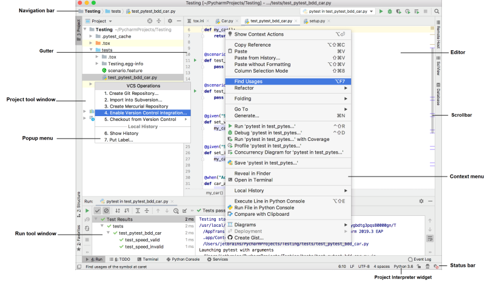

# Taming the Complexity of PyCharm from your Keyboard

These are the materials from a talk first given at a virtual edition of the  [Bangalore Python Developers Meetup](https://www.meetup.com/Bangalore-Python-Group/events/269907207). There where technical problems with the recording, so I'll record the talk again as screencasts and upload them to my [youtube channel](https://www.youtube.com/channel/UCd4MTHLJQm2F4FItvc0nX1g) soon.

**(overview pycharm default UI)**

## What do you see (in the screencasts)?

* Linux with a [tiling window manager](https://github.com/obestwalter/i3config)
* PyCharm with my [customized settings](https://github.com/obestwalter/pycharm-settings)
* [presentation assistant plugin](https://plugins.jetbrains.com/plugin/7345-presentation-assistant) to show the name of (most) actions I trigger via the keyboard, plus the default shortcut on Windows if they exist (orange popup)
* [screenkey](https://www.thregr.org/~wavexx/software/screenkey/) (fixed orange bar at bottom of the screen) to make (almost) all key presses visible

*(overview pycharm customized with screenkey and presentation assistant)*

# General shortcuts (not PyCharm specific)

Doing more things from the keyboard is in part independent from the concrete tool. Here are some central ones:

*(my german notebook keyboard (which I use most of the time))*

## Activate Context Menu with the Keyboard

Instead of **mouse right click**, you can use the `Menu` key on the keyboard (if it exists). In my case I have one on my keyboard, but I need to press **FN+RIGHT-CTRL**, which is very inconvenient for something I do often, so I assigned it to **SUPER+y**.

You can use [xdotool (Linux)](https://github.com/jordansissel/xdotool), 
[autohotkey (Windows)](https://www.autohotkey.com/) or
[no idea (macOs)](https://alternativeto.net/software/xdotool/?platform=mac)
to assign a (more convenient) keyboard shortcut to activate the context menu for the active element.

## Make use of Menu Mnemonics

[Menu mnemonics](https://en.wikipedia.org/wiki/Mnemonics_(keyboard))
 are an idiom used by many graphical user interfaces. If a program uses mnemonics you will see certain characters in menus underlined to signal that you can activate that activity or component by pressing **ALT+[mnemonic]**.

ALT+[some character] shortcuts are also very nice to use for other shortcuts. When some of the default mnemonics have lost their usefulness. When the menu bar is hidden, those mnemonics are also deactivated, so they can be used for something else. E.g. usually **ALT+F** activates the `File menu`, but as I hardly need that anymore, I have repurposed it to activate the `Find results toolbar`.

## Choosing and Activating Dialogue Checkboxes and Buttons

It's the little things. If a dialogue pops up with a bunch of choces and buttons, you could grab the mouse and click around, but you could also cycle through the control elements with **TAB**, [de]activate checkboxes with space and finally "click" on a button with **SPACE** (or also **ENTER** if the swing button fix plugin is installed).
 
## ... and just in general ...

In whatever program or context you are: try out what you can achieve with the keyboard starting with general purpose keys like **ALT**, **TAB**, **ENTER**, **CTRL+ENTER**, **ESCAPE**. They quite often do something useful that you would otherwise have to grab the mouse for.

# Some Plugins to Improve Keyboard Use

Some plugins are necessary / helpful to be less dependent on the mouse.

## Swing Buttons Fix

In most other programs, **ENTER** activates the currently chosen button. In swing (Java GUI framework) it always activates the default button independent of what is chosen. If you don't want to be bitten by this, install this plugin.

**NOTE:** on my system it stops working sometimes (which is visible as chosen file is not entirely highlighted anymore) - restarting PyCharm solves it.

## GoToTabs (Go To Tab 1-9)

**WARNING: not maintained atm**

We will talk a bit more about switching versus navigating later. This plugin adds the possibility to directly navigate to a tab.

GoToTabs can't cope with splitters, so you might want to try the [tab shifter plugin](https://plugins.jetbrains.com/plugin/7475-tab-shifter) as an addition if you use them.

## PyVenvManage (Set Project | Module Venv)

If you have your venvs in your project (e.g. when using tox), this adds a possibility to activate a venv via keyboard shortcut in the `Project View`.

**Dear JetBrains:** this should be in core, don't you agree?

## Keymap Exporter (Print Keymap)

[Keymap Exporter](https://plugins.jetbrains.com/plugin/7066-keymap-exporter) generates a cheat sheet of your customized keyboard layout

Personally don't really have a big need for this, because if I haven't memorized a shortcut yet, I will use **SHIFT,SHIFT** to find the action and can see the shortcut right away. 

**Dear JetBrains:** Would it be possible to not have the keymap reference in help be a PDF but a call to a Keymap Exporter that is merged into core?

# Transforming My Navigation Habits: Loosing The Switcher

**... towards a more keyboard driven and focused workflow**

## Motivation

One of my most used keyboard shortcuts in most apps that have tabs is **CTRL+TAB** to switch forth and back between tabs. PyCharm has the more powerful `Switcher` for that, but the basic functionality of tabbing through is still the same.

**SHIFT,SHIFT Switcher**: no shortcut assigned anymore :)

> Navigate by symbol - not by file.
> 
> -- Paul Everitt (@paulwveveritt)

> I'm not quite there yet (and it's necessary for text files and other files Pycharm doesn't "understand").
>
> -- me ;)

**If possible (and my brain permits)** - I try to navigate to symbols rather than files. If that is not possible (e.g. in the case of text files or if I have only memorized that, where I want to go is in a certain file or folder), then I want to go directly to a file instead of switching my way there, like I used to do (even if it is open somewhere). 

## ALT+y -> Jump to Navigation Bar

As I removed a lot of UI elements that, the navigation bar is also gone, but sometimes it is handy to:
* quickly see where I am or 
* go somewhere relative to where I am now

When the navigation bar is hidden, activating that action activates the bar as a little popup instead.

**ALT+y,DOWN**: open folder overview of file that I'm in at the moment

## CTRL+TAB -> Recent Files

[Still file based] Almost the same as the `Switcher`, but prevents me from mindlessly pressing **CTRL+TAB** until I end up in the right tab, after having gone to the wrong one several times. This works as a habit deterrent, because `Recent Files` switches between all and changed only on repeated presses.

## CTRL+SHIFT+TAB -> Recent Locations

A more fine grained way of switching between locations also inside of files: shows a snippet of code you have visited recently and lets you switch there (can also filter only changed bits).

## ALT+[1-6] -> Go To Tab

*This needs the Go to Tab Plugin*

I often work on several files as part of the same activity, so I still need a convenient way to "switch" tabs, but instead of switching back and forth. Using GoToTabs I assigned **ALT+[1-6] to Go To Tab [1-6]. I also set the closing policy to max 6 and close unused first. Why 6? Because I can immediately "see" which number a tab has, if I have six. I can also still comfortably reach the 6 with my left index finger, when I press ALT with my left thumb. With seven I already need to count and need to stretch too much to get to 7 on the keyboard ... YMMV - anyway nobody will ever need more than six open tabs.

## SHIFT,SHIFT -> Search Everywhere

This let's you reach pretty much anything all in one place or separated into Classes/Files/Symbols/Actions. Speed Searching (word border aware partial search) often leads to only having to type 3 or 4 letters before being able to pick the wanted action/location from the narrowed down list.

You can also change all settings that can be toggled (don't need input or more complex settings) directly in the `Search Everyhwere` popup.

Although you can easily tab through the sections, I also set shortcuts for `File` search to **CTRL+P** and for `Action` search to **CTRL+SHIFT+P** (like in sublime text and VS code).

## Browse Code -> `Jump To Source` / `Navigate back|forward`

When trying to figure out how things work it is often necessary to browse around in the code. Drilling down some definition stack and getting back to where you where from there. 

Shortcut wise, this is something I haven't figured out yet with a satisfying consistency ... 

What I really want is `Jump To Source` to work e.g. from the `Project View Tool Window` to jump to the file and in an active editor I want the same shortcut to do `Go to Declaration or Usages`. But if both actions have the same shortcut in an active `Jump To Source` wins over `Go to Declaration or Usages` and at first looks like it is doing the same, but when on a declaration it just jumps to the beginning of the line instead of showing usages, so my feeling would be that they should be the same action and just do the right thing depending on context just like `Go to Declaration or Usages` is already doing.

My current workaround for this is to have **F3** assigned to `Jump To Source` and **SHIFT+F3** assigned to `Go to Declaration or Usages` and . 

A complete mystery to me is `Find Usages Settings...` - it doesn't seem to exist - I assigned a shortcut to it to find out what it does, but nothing happens ...

**Dear JetBrains:** is there a way to make this more consistent? 

## Also Important -> Navigation Inside a File

* of course the usual: arrow keys, **PAGE UP|DOWN**, **HOME**, **POS1**, **END**
* Activate `File Structure` and start typing where you want to go (smart search!)
* (not really navigation but fits here) activate the `Structure Tool Window` to have a high level view on the file 
* `Previous/Next Method` to jump between functions/methods (also works e.g. for headlines in markdown files, etc.)
* `Go to Line/Column` to jump to a specific point
* `Find` to find text inside the editor and navigate between hots via `Find Previous/Next / Move To Previous/Next Occurrence`
* CTRL+[UP|DOWN] go to previous|next highlighted error

# Taking Control of my Windows and Tabs

When you don't want to use the mouse to "get" somewhere in the IDE you need shortcuts to activate certain areas or manipulate their size and position.

## TAB -> Switch between Sections in pop ups

In pop ups with tabs / different sections **TAB** switches between them 

## ESC / CTRL+ESC Jump between Editor and Tool Window

Handy when switching back and forth between the same tool window and editors (e.g. find results and different editors)

**ESCAPE** always jumps to the last active editor

I also assigned `Jump to last Tool Window` to **CTRL+ESC** to get back to the last used tool window from the editor. 

**Dear JetBrains:** Maybe **ESC** could automatically jump back to the last used tool window, when the cursor is in the editor?

## CTRL+SHIFT+F12 / CTRL+F12 -> `Tool Windows View Modes` 

I usually switch only between `Dock Pinned` and `Window`, so I assigned shortcuts only to them. 

## CTRL+ALT+[ARROWS | Plus] Resize `Active Tool Window` and pop ups

Sure, you can resize them by dragging the edge with the mouse, but that gets old quickly.

I set it so that:
* **CTRL+ALT+[UP|DOWN|LEFT|RIGHT]:** expands or shrinks the tool window or popup in the given direction.
* **CTRL+ALT+Plus:** to toggle between maximized / and last unmaximized size

## ALT+SHIFT+F11 `Active Tool Window` -> `Move To ...`

To move the window to a different edge without having to drag it with the mouse. 

## ALT+F1 (on a file) Select In...

E.g. if I am in the editor and want to rename the file: `Select In ... ->  Project View`, `F2`, `ESC`, done.

## CTRL+^ `Select next tab` in Active Tool Window 

Switching between different tabs (sadly) is different from editors but it is also possible to assign a shortcut to them.

I assigned it to the key just above the tab as it has somehow the same function how usually tabs are switched via CTRL+TAB (back from the days, when I still did that). 

**Dear Jetbrains:** Is there any way to make tabs in tool windows first class citizens that are then also shown in the `Rectent ...` dialogues? I have no idea if this is feasible from a UI perspective, but conceptually a search result is just like an editor tab that I would like to jump to directly via selection or speed search in a recent files dialogue.

# How to Have a Good Time with PyCharm

## Protect yourself from yourself (and from JetBrains)

Put your config under source control, commit regularly, describe what the changes where meant for. commit often enough that you can revert changes to figure out which change might have broken something that you considered unrelated (there are a lot of interesting corner cases once you customize things a lot).

**A word of warning** there are also advanced options to [sync / share settings](https://www.jetbrains.com/help/pycharm/sharing-your-ide-settings.html#). Check them out and use them if you like, but make sure you also have your own backup. I had sync settings activated and at the beginning of this year I managed to hose my complete config (which had organically grown over years) using this and stupid me had only a very out of date private backup. 

On the plus side: I used this as an opportunity to start from scratch and go through the whole configuration process in a more systematic manner this time, which is the reason why you are reading/watching this now. So badly breaking things or loosing them isn't always necessarily bad :)

## Incrementally improve your workflow, while working

When you do something often using the mouse and it gets annoying: learn the shortcut or assign one yourself (or an abbreviation). If you forgot the shortcut look it up or use `Find action` to access the activity until you have memorized it (`Find action` always shows the shortcut)

**Dear JetBrains:** it would be great if you would also show the custom abbreviation of an action in `Find actions`

## Discoverability is your Friend

Make use of it if you have not much experience with PyCharm yet. Do not try to emulate my working environment by switching all these visual clues off that more experienced users consider "visual clutter". For a long time I was very grateful that all these visual clues where there and that I was able to click my way through to accomplish what I needed to accomplish. Only over time you get to a point, where these clues start to be an annoyance. But now you already know, that can make them go away when it's time to take the training wheels off.

## Explore the possibilities

* explore the settings - that will give you an idea what you can change (spoiler: almost everything)
* hover with your cursor over functionality where you want to know what their official name and current shortcut is to be able to use that on the keyboard next time
* use `Find Action` to toggle simple settings directly instead of going to `Settings` (select and **ENTER**)
* use `Find Action` to change shortcuts directly from there (**ALT+ENTER**)
* In `Configure Shortcuts ...`: use the search bar and the `Find Actions By Shortcut` button to get an overview of related shortcuts and to set a group of related shortcuts all at once.
* when setting shortcuts, check for potential conflicts and make sure you do the right thing when asked to `Leave` or `Remove` the same shortcuts
* have a look at the productivity guide to find out what else you could improve
* read the [documentation](https://www.jetbrains.com/help/pycharm/quick-start-guide.html)
* check out the great [PyCharm guide](https://www.jetbrains.com/pycharm/guide/) for ideas what you can improve in your workflow.

## There is more than Simple Shortcuts (Abbreviations and Second Stroke)

When a simple shortcut is too much but you want to have your "own" way of accessing it, add an abbreviation. E.g. I added `git push` for `Push` and `git pull` for `Update project` and `git log` for `Show History` as I don't want them as keyboard shortcuts, but I want them easy to access and more consistent. These abbreviations are then understood in `Search Everywhere` (but sadly not shown (yet) as a hint like the other shortcuts.

Another interesting option is to assign a second stroke to shortcuts. E.g. I assigned `Stretch Splitter ...` to CTRL+ALT+SHIFT+s,[ARROWS].

## Reminder: Filters are Everywhere! Just start typing ...
 
Wherever you are: start typing to see if it starts filtering (and most of the time it does)
* `Structure`
* `Branches...` popup - filter actions 
* `Recent Files` popup 
* `Settings`
* `Project view`

**BUT!** No filters in context menus (but **mnemonics**)

## Context is King

Actions are usually context sensitive so it matters where the keyboard focus is, when you trigger the action. So if you trigger an inspection, while on a folder in the `Project View` the inspection is set to only run inspections in that folder.

In project view on a folder action is specific to that folder:
* inspections
* git/local history
* reformat

## (If we still have time) Some Little Gems ...

* partial VCS based undo: use `Rollback Lines`reverts only the changed chunk under the cursor to it's original state
* "code" completion (**CTRL+SPACE**) works also for paths (e.g. in the File open dialogue)
* smart filter all the things: "speed search" or what I would call "smart filtering" works pretty much in all areas, where you work with a list of items. Just start typing to filter the items wherever you have a hunch it should work. The only place where I wish it would work but doesn't is the classic context menu :)
* `Quick Definition` and `Quick Documentation` works pretty much everywhere - try it in code completion popups or in the `Project View` (also check out the other `Quick ...` actions, good stuff!)
* activate "change font size with CTRL+[Mouse Wheel] - it really should be on by default
* if your date format looks all wrong e.g. in commit view `Settings -> Date Format`: `YYYY-MM-dd` and use 24 hour time are objectively the only sane settings and should be the default anyway;)

# Learned something? Tweet me your favorite

*([my handle is @obestwalter](https://twitter.com/obestwalter))*

I hope you get a few ideas about how to improve your workflow and make it more keyboard driven.
